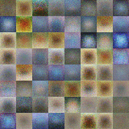

Generative Adversarial Network for CIFAR-10 dataset 
==
* project implemented as part of the *Deep Learning Methods* course attended on MSc degree of *Data Science* at the *Faculty of Mathematics and Information Sciences* in *Warsaw University of Technology*,
* the implemented architectures are **DC-GAN** and **MLP-GAN**,
* written in `TensorFlow r1.13`.

Prerequisites to run
---
* Google Colab access,
* Google Storage Bucket with public access.

How to run via Google Colab
---
There are three files for Google Colab, which are described below:
* `Google_Colab_Train_eval_predict.ipynb` - main notebook which allows to train GAN model, make small evaluation and generate images based on noise,
* `Google_Colab_Most_similar.ipynb` - after training model you can use this notebook to find most similar images in training set to that which your model can generate,
* `Google_Colab_Latent_space_interpolation.ipynb` - this notebook can ensure you that the GAN model has learnt some deep knowledge about the training set examples.

In order to run any of script please do following:
1. Open `Google_Colab_*.ipynb` in Google Colab by clicking any of these links: [train_eval_predict](http://colab.research.google.com/github/VictorAtPL/CIFAR-10_GAN_Tensorflow/blob/master/Google_Colab_Train_eval_predict.ipynb),
[most_similar](http://colab.research.google.com/github/VictorAtPL/CIFAR-10_GAN_Tensorflow/blob/master/Google_Colab_Most_similar.ipynb), [latent_space_interpolation](http://colab.research.google.com/github/VictorAtPL/CIFAR-10_GAN_Tensorflow/blob/master/Google_Colab_Latent_space_interpolation.ipynb),
2. modify variables placed in the first cell of each notebook,
3. run all cells,
4. after all cells execution, please take a look either on the cells output or the Google Storage Bucket, which you provided to store model's checkpoints and generated images in.

Results
---
Animation showing generated images during training of _MLP-GAN_ and _DC-GAN_ architectures:
1. MLP-GAN:
    
    
    
2. DC-GAN:

    

Image generated for 1000-epoch trained _DC-GAN_ using `Google_Colab_Latent_space_interpolation.ipynb`:
    

Image generated for 1000-epoch trained _DC-GAN_ using `Google_Colab_Most_similar.ipynb`:

For more results and diagrams of architectures please read `Project_Final_Report_PL.pdf` file.